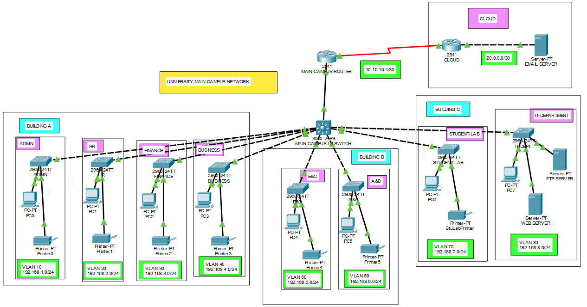
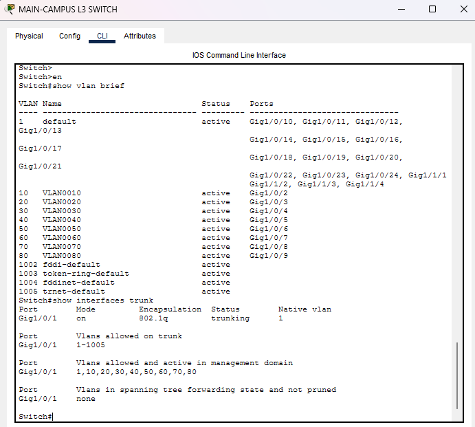

# Enterprise University Campus Network

## Overview

This project is a simulated **enterprise university campus network** built and configured in **Cisco Packet Tracer**.

The goal of the project was to create a functional campus network that connects multiple university departments across several buildings while keeping each department logically separated through VLANs. The university campus contains three buildings and eight departmental networks.

The network also provides:

- Inter-VLAN communication
- Dynamic IP addressing
- Dynamic routing
- WAN connectivity
- Internal server access
- External email server connectivity

The project provided hands-on experience with Cisco IOS configuration, routing and switching, subnetting, DHCP, VLANs, 802.1Q trunking, and network troubleshooting.

### Final Network Topology



---

### Building A

- Administration
- Human Resources
- Finance
- Business

### Building B

- Engineering & Computing (E&C)
- Arts & Design (A&D)

### Building C

- Student Lab
- IT Department

The IT Department also contains internal:

- Web Server
- FTP Server

The university network connects through a Cisco 2911 Main Campus Router to a simulated Cloud Router, which provides access to an external Email Server.
---

## VLAN and IP Addressing Plan

Each university department was assigned its own VLAN and `/24` IPv4 subnet.

| VLAN | Department | Network | Default Gateway |
|------|------------|---------|-----------------|
| 10 | Administration | 192.168.1.0/24 | 192.168.1.1 |
| 20 | Human Resources | 192.168.2.0/24 | 192.168.2.1 |
| 30 | Finance | 192.168.3.0/24 | 192.168.3.1 |
| 40 | Business | 192.168.4.0/24 | 192.168.4.1 |
| 50 | E&C | 192.168.5.0/24 | 192.168.5.1 |
| 60 | A&D | 192.168.6.0/24 | 192.168.6.1 |
| 70 | Student Lab | 192.168.7.0/24 | 192.168.7.1 |
| 80 | IT Department | 192.168.8.0/24 | 192.168.8.1 |

Using separate VLANs creates individual Layer 2 broadcast domains for each department.

---

## Technologies and Concepts Implemented

This project includes:

- Cisco Packet Tracer
- Cisco IOS
- Cisco 2911 Routers
- Cisco Access Switches
- Cisco Campus Switch
- VLAN Segmentation
- IEEE 802.1Q Trunking
- Router-on-a-Stick
- Inter-VLAN Routing
- DHCP
- IPv4 Addressing
- Subnetting
- RIPv2 Dynamic Routing
- WAN Connectivity
- Serial Point-to-Point Networking
- Routing Tables
- ICMP Connectivity Testing
- Network Troubleshooting

---

## VLAN Segmentation

Eight VLANs were configured to logically separate university departments.

The campus switch assigns each departmental connection to its corresponding access VLAN.

```text
VLAN 10 -> Administration
VLAN 20 -> Human Resources
VLAN 30 -> Finance
VLAN 40 -> Business
VLAN 50 -> E&C
VLAN 60 -> A&D
VLAN 70 -> Student Lab
VLAN 80 -> IT Department
```


